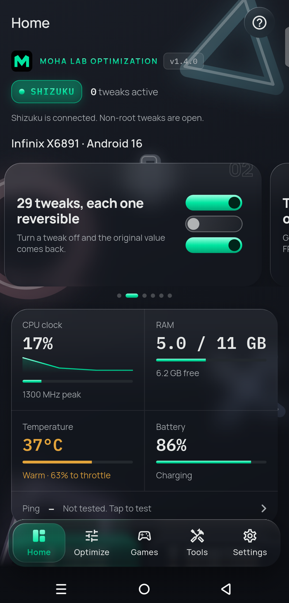
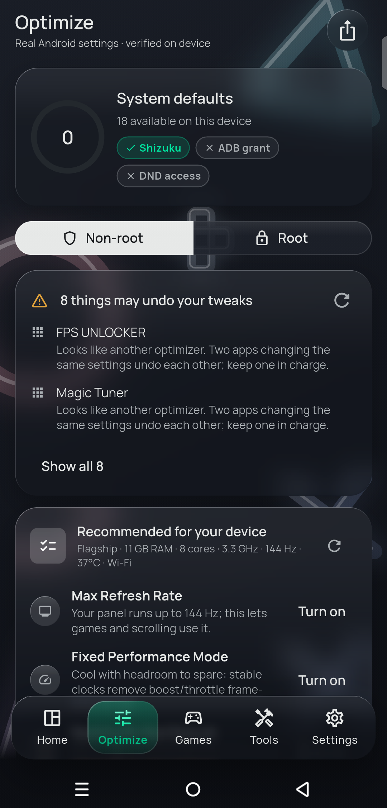
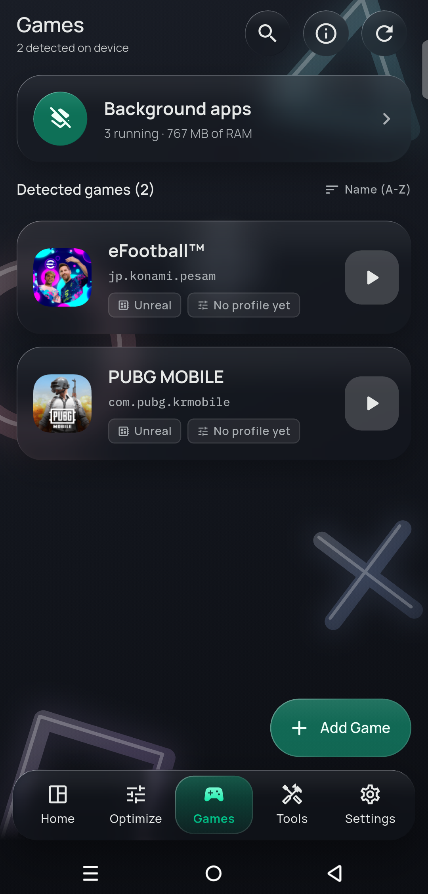

# Changelog

Download the latest signed APK from [Releases](../../releases/latest).
Any APK from another source is unofficial.

## v1.4.0 — October 4, 2026

### New look
- **Liquid glass on every screen:** panels, buttons, bars, sheets and dialogs bend what is behind them, with a lit edge. Green actions and "on" states are green glass.
- **Calm dark theme by default,** and a light theme in Settings.
- **New logo and app icon:** the green Moha Lab M on black, with the logo and your version at the top of Home.
- **Home banners** that show how Moha Lab works. Swipe them or let them move on; the last one links to the community.
- **New opening sound,** and a glass press when you tap.
- **New layout:** Home, Optimize, Games, Tools and Settings; the labs now live in Tools.

### New
- **FPS cap that works on more phones:** where Android ignores its per-game frame-rate limit, Moha Lab caps the screen refresh rate while the game runs and puts it back when you leave (start the game from Moha Lab).
- **Ultra Cleaner (Shizuku):** app caches, shared-storage caches and thumbnail caches, with the space really freed. Your own files are only removed when you tick them; root adds system logs.
- **CPU and GPU governor choice (root),** from the governors your kernel offers.
- **Performance check:** finds what slows your phone, why, and what to do.
- **ANGLE on Vulkan tweak,** and Device Lab shows your GPU, OpenGL ES and Vulkan versions.
- **Memory Lab, CPU cores graph, Background apps** in Games, and per-game graphics driver and priority.

### Improved
- Game Mode, render resolution and FPS can be set independently, and the app tells you when to reopen the game to apply them.
- Games show which graphics driver was really used, and only offer drivers that can load on your phone.
- ANGLE on Vulkan opens Developer options, the only place Android lets you switch it.
- Max Refresh Rate tells you honestly when your phone keeps a 60 Hz floor.

### Fixed
- Tabs that needed two taps.
- Free cached apps on phones with dual apps.
- Unreadable governor buttons in dark mode.
- Sheets that would not scroll and buttons hidden behind the tab bar.

No ads in this version.

### Verify your download
The official APK is signed with this certificate (SHA-256):

`C0:E2:5B:F8:20:CB:58:42:73:60:0C:E5:7A:89:52:FF:92:D4:FE:F8:EF:9A:AE:F4:E4:DD:9C:26:F9:3F:0D:1F`

## v1.3.0 — September 30, 2026

### New
- **CPU & GPU limits (root):** live clock graph for every CPU cluster and the GPU. Lock a minimum and maximum frequency chosen from your kernel's own steps. The app reads every change back and tells you if the phone overrides it.
- **New tweaks:** Performance Resolution, Keep Battery Saver Off and Disable Haptics.
- **Mobile data tweaks:** Keep Mobile Data Ready (no root), plus Keep Speed After Pauses, Mobile Packet Size Probing and TCP Fast Open for 4G / 5G (root).
- **Your real mode on Home:** shows Root, Shizuku, ADB or Basic mode, where it comes from, and how many tweaks can run on your phone.
- **Better game detection:** games are found by category, game engine (Unity, Unreal, Cocos, Godot, libGDX) and known publishers.
- **Update alerts:** the app tells you when a new version is published here, and shows what changed after you update.
- **Game reminders:** optional reminders before you play (off, daily, or every 12, 6 or 3 hours).

### Improved
- Opens much faster and scrolls smoother.
- Fixed crashes on older Android versions, custom ROMs, and after installing or updating the app.
- Settings, the opening animation and the guided tour were fixed.
- Backups now restore your active tweaks.
- Clearer help when Shizuku is running but not connected to the app.
- No ads in this version.

### Security
- Modified or re-signed copies of the app are detected and refuse to run.
- First-launch agreement.
- Anonymous usage statistics (Firebase Analytics), asked for consent first in the EEA and the UK. See the [privacy policy](store/privacy-policy.md).

### Verify your download
The official APK is signed with this certificate (SHA-256):

`C0:E2:5B:F8:20:CB:58:42:73:60:0C:E5:7A:89:52:FF:92:D4:FE:F8:EF:9A:AE:F4:E4:DD:9C:26:F9:3F:0D:1F`

## v1.2.0 — September 29, 2026

- Glass redesign and guided tour.
- Tweaks are read back from the device after every change.
- Root mode for Magisk, KernelSU and APatch.
- ART compile for games, with recommendations for your device.
- Tweaks stay on after you leave the app.
- Google AdMob ads added.
