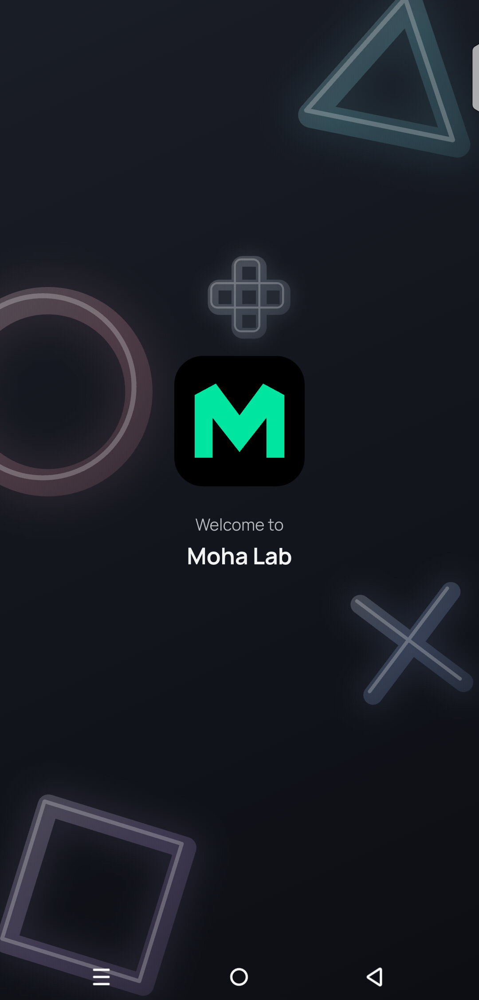
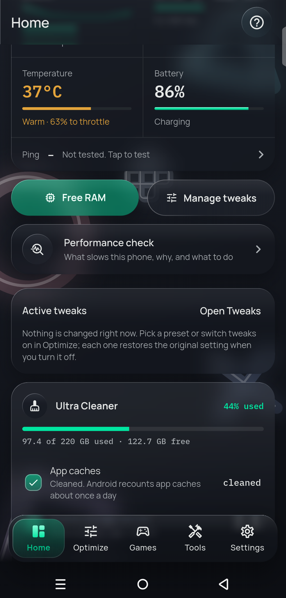
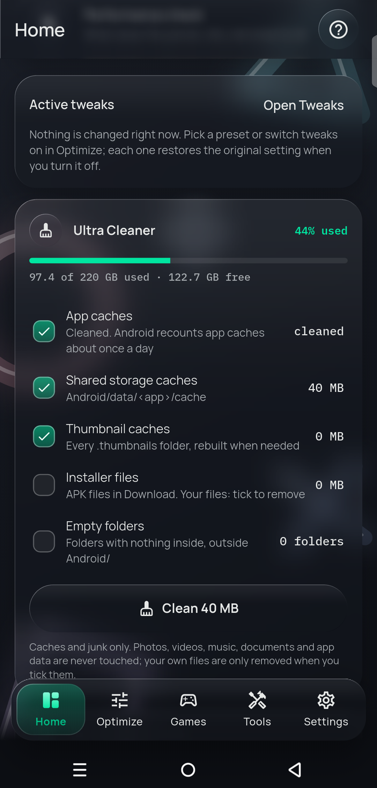
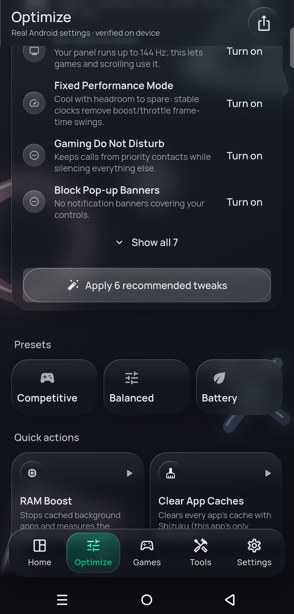
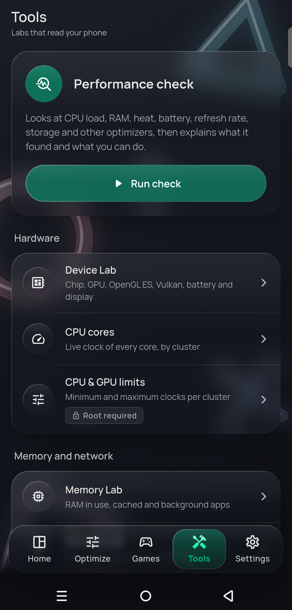
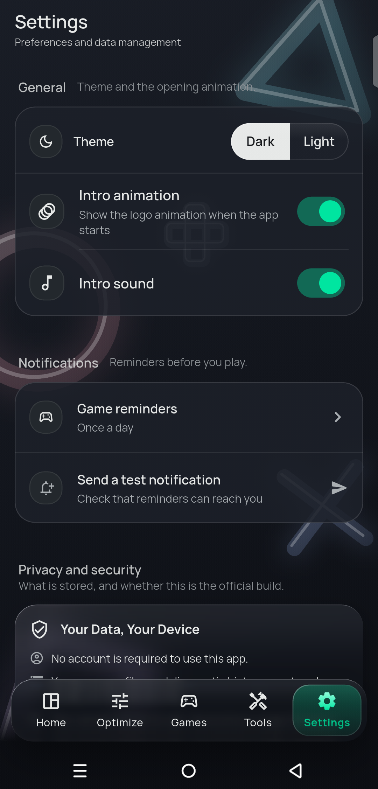
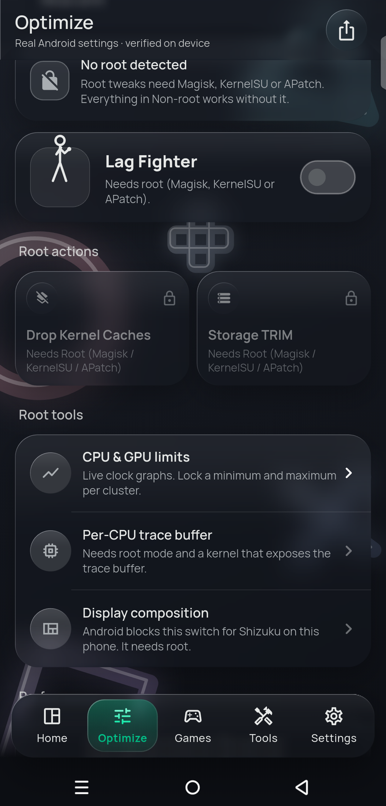
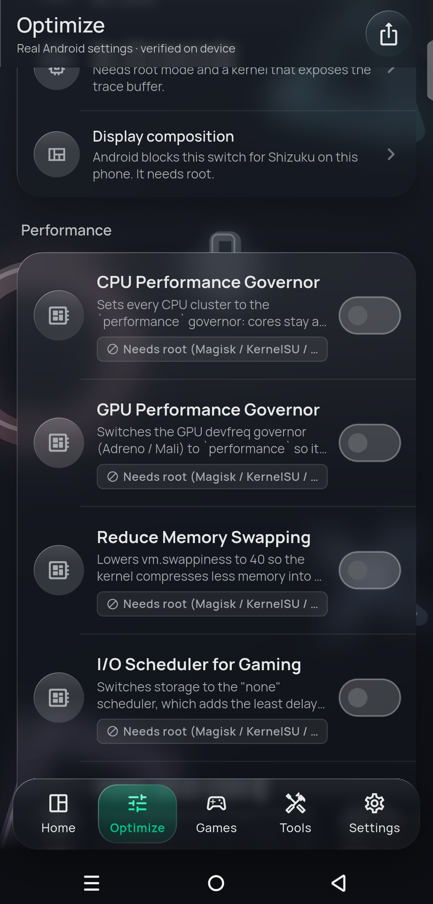
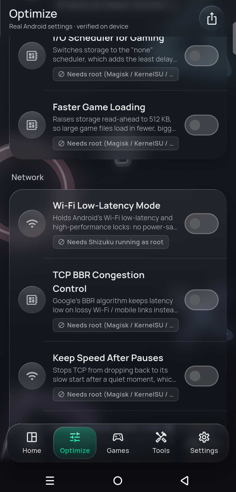
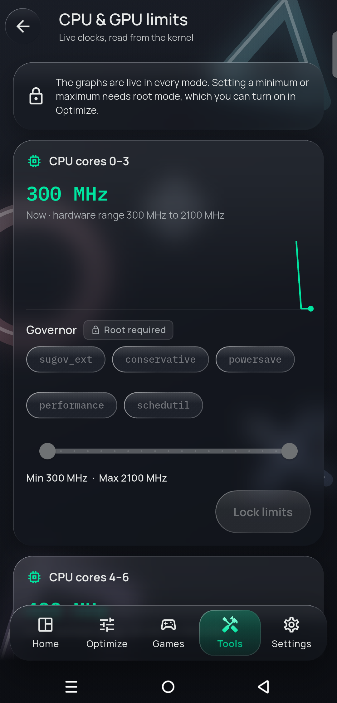

# ⚡ Moha Lab Optimization

<div align="center">


**High-Performance Android Gaming & System Tuning Framework**

[](https://flutter.dev)
[](https://dart.dev)
[](https://android.com)
[](https://shizuku.rikka.app/)
[](LICENSE)

[Features](#-key-features) • [Architecture](#-architecture) • [Security & Privacy](#-security--privacy) • [Review the code](#-review-the-code) • [Community](#-community--links)

</div>

> 🔎 **Published for transparency — view only.**
> This code is public so anyone can check exactly what the app does on their phone.
> It is **not open source**: copying, modifying, building or redistributing it is not permitted (see [LICENSE](LICENSE)).
> **Official download:** [Releases](../../releases/latest) — any other build is unofficial.

## 📥 Download

Get the latest signed APK from **[Releases](../../releases/latest)** — open it on your phone and allow *Install unknown apps*.

### Screenshots (v1.4.0)

<p align="center">



</p>
<p align="center">



</p>
<p align="center">



</p>

**Root mode** (Magisk, KernelSU, APatch)

<p align="center">




</p>

---

## 📖 Overview

**Moha Lab Optimization** is an Android gaming utility that applies **real, verifiable system tweaks** — documented Android settings and `cmd` services — with live telemetry, per-game Game Mode tuning and gaming network diagnostics.

Built with **Flutter** in a **liquid glass** design (calm dark theme by default, light theme in Settings), it works rootless through the **Shizuku API** (or a one-time ADB permission grant for settings-based tweaks).

---

## ✨ Key Features

### ⚙️ 1. Verified System Tweaks
- Lock max refresh rate, faster animations, disable window blurs, fixed performance mode, gaming Do Not Disturb, block pop-up banners, private DNS, background scan control, faster touch & hold.
- Every tweak is **read back from the device** after applying — toggles reflect real state and survive app restarts.
- Original values are saved on-device before the first change and restored exactly when switched off.
- Tweaks Android resets on reboot are re-applied automatically when Shizuku reconnects.

### ⚡ 2. Rootless Privilege Paths
- **Shizuku**: full access to settings and `cmd` services (power, game, package, notification).
- **ADB grant** (`pm grant … WRITE_SECURE_SETTINGS`): unlocks every settings-based tweak without Shizuku.
- No arbitrary shell endpoint — commands are built natively from fixed templates and validated arguments.

### 🔓 Root Mode (Magisk / KernelSU / APatch)
- Tweaks are split into **Non-root** and **Root** tabs.
- Detects Magisk, KernelSU (and Next), APatch and Kitsune; "Grant root" triggers the manager's standard `su` prompt. One persistent root shell is reused (no per-command toasts); the grant is resumed silently on next launch.
- **Lag Fighter:** cuts micro-stutter: the CPU speeds up the moment a frame needs it and the game on screen gets priority over background work.
- CPU and GPU **governor choice** from the governors your kernel offers, and minimum / maximum clock limits with live graphs.
- I/O scheduler for gaming and faster game loading (storage read-ahead); Ultra Cleaner also clears system logs.
- Root-only kernel tweaks: CPU performance governor, GPU (Adreno / Mali) performance governor, TCP BBR, reduced swappiness, Wi-Fi low-latency / high-perf locks. Root actions: drop kernel caches, storage TRIM.
- Every kernel node's original value is saved and restored; values reset on reboot and active tweaks are re-applied when the root session resumes. Shizuku started as root is also treated as root.

### 🎮 3. Per-Game Tuning (Android 13/14+ Game Mode)
- Game Mode (standard / performance / battery), render-resolution downscale and FPS override per game.
- Where the phone ignores Android's per-game FPS limit, the FPS cap is applied through the screen refresh rate while the game runs, and restored when you leave.
- The graphics driver each game really used is read back from Android.
- Settings are per-app and only active while the game runs.
- ART `speed` compilation per game; Turbo Launch applies the profile before launching.

### 🧹 4. Measured Maintenance
- RAM Boost, **Ultra Cleaner** (app, shared-storage and thumbnail caches; system logs with root) and ART background dexopt — results are measured (MB freed), never estimated.
- Your own files (installer APKs, empty folders) are only removed when you tick them.

### 🌐 5. Gaming Network Diagnostics
- Latency, jitter and packet-loss probing with connection quality scoring.

### 📊 6. Live Telemetry
- Per-core CPU clocks, battery temperature with PowerManager thermal status and throttling-headroom forecast, RAM, battery and storage.

---

## 🏗️ Architecture

The codebase adheres to **Clean Architecture** with strict feature separation and modular domain boundaries:

```
lib/
├── core/
│   ├── constants/             # App-wide configurations and presets
│   ├── theme/                 # Glass design tokens, colors & typography
│   └── utils/                 # Security, platform checks, and formatting
├── features/
│   ├── diagnostics/           # Hardware telemetry & thermal sensors
│   ├── games/                 # Game library, detection, and per-game Game Mode tuning
│   ├── home/                  # Dashboard, live telemetry & quick actions
│   ├── network/               # Ping latency, packet loss, & network tests
│   ├── onboarding/            # First-run guided setup & permissions tour
│   ├── optimization/          # Tweak catalog, presets & TweakEngine bridge
│   ├── settings/              # App preferences, data backup, & cache management
│   └── shizuku/               # Shizuku IPC bridge & permission flow
├── shared/
│   └── widgets/               # Glass cards, sheets, navigation shell & components
└── main.dart                  # Application entry point & Riverpod provider scope
```

Native side (`android/app/src/main/kotlin/.../`): `TweakEngine.kt` owns every privileged command, snapshots and state read-back; `ShizukuBridge.kt` executes them with exit-code checking.

---

## 🛡️ Security & Privacy

- **Fixed commands only.** Every privileged command is built from a fixed template inside
  `TweakEngine.kt`; arguments are validated (package-name regex, allow-listed values and paths).
  There is no "run any command" entry point from the UI.
- **Reversible.** Original values are saved on the device before the first change and restored
  when a tweak is switched off.
- **No account, no uploads of your data.** Device information is read and processed on the phone
  only. Anonymous usage statistics (Firebase Analytics) are asked for first in the EEA and the UK.
- **Ads:** versions 1.3.0 and 1.4.0 show no ads. See [store/privacy-policy.md](store/privacy-policy.md).
- Details: [SECURITY_AUDIT.md](SECURITY_AUDIT.md) · [PERMISSIONS_AND_PRIVACY.md](PERMISSIONS_AND_PRIVACY.md)

---

## 🔎 Review the code

Everything that touches system settings lives in three Kotlin files — start here:

| File | What it does |
|---|---|
| [`TweakEngine.kt`](android/app/src/main/kotlin/com/mohalab/optimization/TweakEngine.kt) | Every tweak: the exact setting / command, snapshot of your original value, read-back check, restore |
| [`ShizukuBridge.kt`](android/app/src/main/kotlin/com/mohalab/optimization/ShizukuBridge.kt) | Runs those commands through Shizuku and checks exit codes |
| [`RootShell.kt`](android/app/src/main/kotlin/com/mohalab/optimization/RootShell.kt) | Optional root session (Magisk / KernelSU / APatch) |

The Dart side lists every tweak with the exact change it makes in
[`tweak_catalog.dart`](lib/features/optimization/domain/tweak_catalog.dart) — the same text the app
shows under "Exactly what changes".

Network access: Google AdMob (ads) and the in-app network test only.

---

## 🌐 Community & Links

- 🌐 **Official Website:** [mohagaminglab.vercel.app](https://mohagaminglab.vercel.app/)
- ✈️ **Telegram Channel:** [@Mohagaminglab](https://t.me/Mohagaminglab)
- 🎵 **TikTok:** [@professor0011110](https://www.tiktok.com/@professor0011110?_r=1&_t=ZS-99v0tA6CxRS)
- 🐙 **Developer GitHub:** [@7Mohan](https://github.com/7Mohan)

---

## 📄 License

Copyright © 2026 Mohamed Bashir Ali ([@7Mohan](https://github.com/7Mohan)). All rights reserved.

Source-available, **view only** — see [LICENSE](LICENSE). You may read this code to verify the app;
copying, modifying, building or redistributing it requires written permission.
